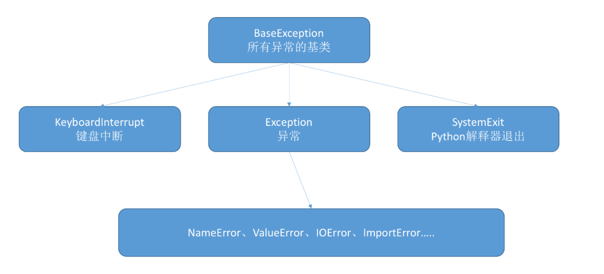

## python的异常继承树


## 最简单的自定义异常
```
class MError(Exception):
    pass
```

## 抛出异常
```
try:
    raise MError('自定义异常')
except MError as e:
    print(e)
```
```
class CustomError(Exception):
    def __init__(self,ErrorInfo):
        super().__init__(self) #初始化父类
        self.errorinfo=ErrorInfo
    def __str__(self):
        return self.errorinfo

if __name__ == '__main__':
    try:
        raise CustomError('客户异常')
    except CustomError as e:
        print(e)
```